<div align="center">

<br/>

```
 ██████╗ █████╗ ██████╗ ███████╗██╗   ██╗██╗     ███████╗
██╔════╝██╔══██╗██╔══██╗██╔════╝██║   ██║██║     ██╔════╝
██║     ███████║██████╔╝███████╗██║   ██║██║     █████╗  
██║     ██╔══██║██╔═══╝ ╚════██║██║   ██║██║     ██╔══╝  
╚██████╗██║  ██║██║     ███████║╚██████╔╝███████╗███████╗
 ╚═════╝╚═╝  ╚═╝╚═╝     ╚══════╝ ╚═════╝ ╚══════╝╚══════╝
                              L A B S
```

**Automation · Scraping · Intelligence · Delivery**


<br/>

> *Client work is confidential — this repository showcases inputs, outputs, and visual results only.*

<br/>

---

</div>

<br/>

## 📁 Repository Structure

```
capsule-labs/
├── full_scraper_based/          # Web scraping solutions
│   ├── bsp/
│   ├── epicsports/
│   ├── kieran/
│   ├── kinchrome/
│   └── thereisanaiforeverything/
│
└── tool_based/                  # Custom automation tools
    ├── bess/
    ├── encuentra24/
    ├── euro/
    ├── franchesco/
    ├── fusselbaugh/
    ├── josh_music/
    ├── labels/
    ├── marketmap/
    ├── pascal/
    ├── paul_project/
    ├── pdf_manipulation/
    └── pdf_watermark/
```

<br/>

---

<br/>

# 🕷️ Full Scraper Based Projects

> End-to-end web scraping pipelines — data extraction, transformation, and structured output delivery.

<br/>

---

## `bsp` — Multi-Site Master Scraper

**A batch scraper that aggregates data across a list of target sites into a unified master database.**

Handles multiple source URLs, normalizes inconsistent data structures, and outputs a clean consolidated dataset. Designed for resilience and repeatability across scheduled runs.

**Highlights:** Multi-URL ingestion · Data normalization · Master DB output · Fault-tolerant pipeline

<br/>

---

## `epicsports` — Sports Data Scraper

**Full scraper for the EpicSports platform, extracting structured product and category data at scale.**

| Website |
|:-------:|
| 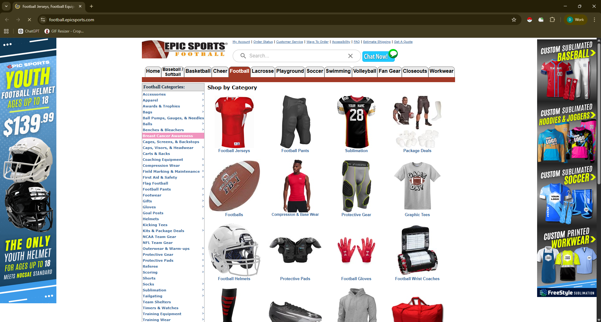 |

**Highlights:** Category traversal · Pagination handling · Structured product data output

<br/>

---

## `kieran` — School Data Scraper with Bot Detection Bypass

**Scrapes school-related data with robust anti-bot handling — including Cloudflare and CAPTCHA bypass layers.**

| During Bot Detection | After Bot Detection | Target Page Sample |
|:--------------------:|:-------------------:|:------------------:|
|  |  |  |

**Highlights:** Bot detection bypass · Session persistence · Structured school data extraction

<br/>

---

## `kinchrome` — Kincrome Product Scraper

**Dedicated scraper for the Kincrome product catalog — tools, hardware, and accessories.**

| Website |
|:-------:|
|  |

**Highlights:** Product catalog traversal · SKU extraction · Image URL capture · Clean CSV/JSON output

<br/>

---

## `thereisanaiforeverything` — AI Tools Aggregator

**Dual-source scraper pulling AI tool listings from `thereisanaiforthat.com` and `toolify.ai` into one unified database.**

| There Is An AI Website | Toolify Website |
|:----------------------:|:---------------:|
|  |  |

**Highlights:** Multi-source aggregation · Deduplication · Category tagging · AI tool metadata extraction

<br/>

---
---

<br/>

# 🛠️ Tool Based Projects

> Custom-built desktop and web tools — automation UIs, data processors, and intelligent pipelines delivered to clients.

<br/>

---

## `bess` — Shortlisting & Data Processing Tool

**A streamlined tool for filtering, shortlisting, and processing large datasets based on configurable criteria.**

| Tool Interface | Shortlist View | Working State |
|:--------------:|:--------------:|:-------------:|
| 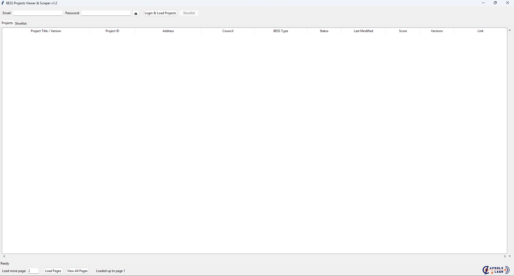 | 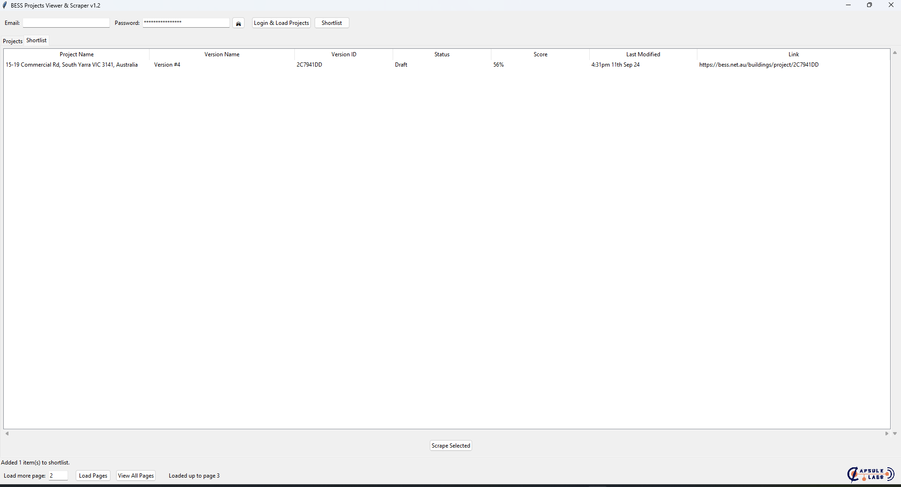 | 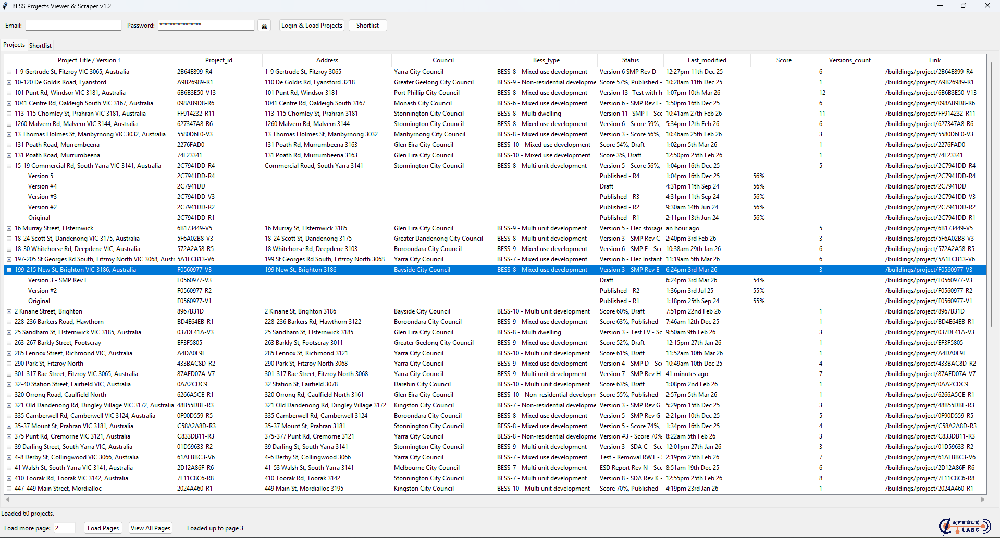 |

**Highlights:** Rule-based filtering · Shortlist generation · Real-time processing feedback

<br/>

---

## `encuentra24` — Encuentra24 Interaction Tool

**Automation tool for interacting with the Encuentra24 classifieds platform — browsing, filtering, and data extraction.**

| Website | Tool |
|:-------:|:----:|
| 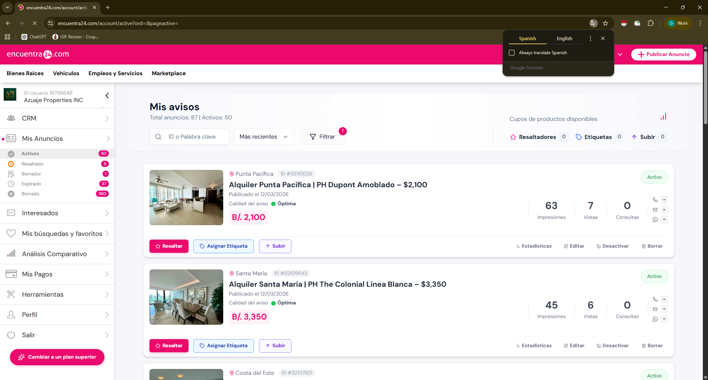 | 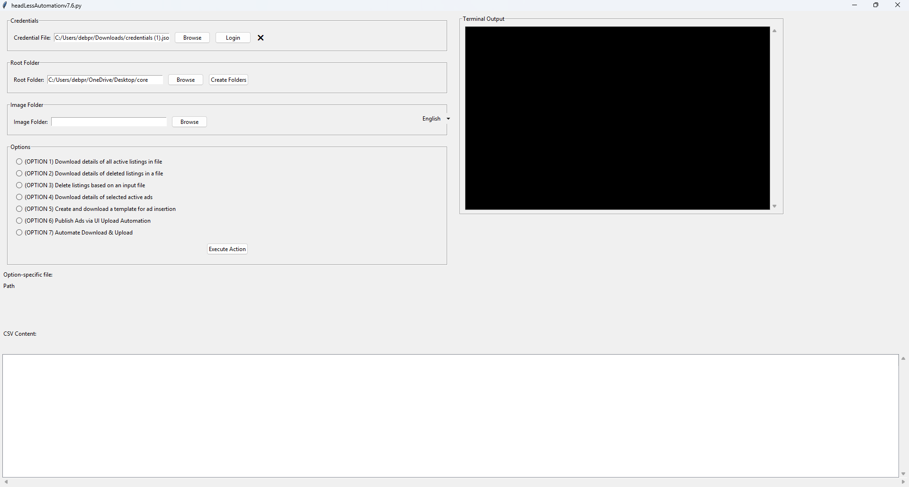 |

**Highlights:** Listings interaction · Category-based filtering · Structured data export

<br/>

---

## `euro` — Data Processing Pipeline Tool

**A multi-stage data transformation tool handling ingestion, cleaning, and structured output across several processing steps.**

| Stage 1 | Stage 2 | Stage 3 | Source |
|:-------:|:-------:|:-------:|:------:|
|  |  |  | 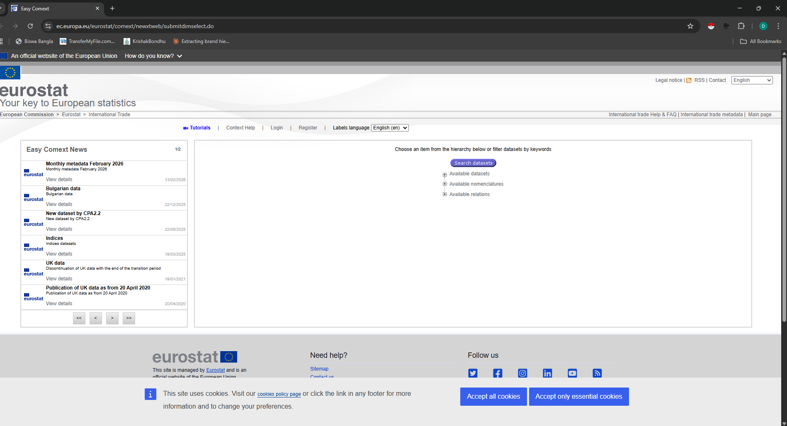 |

**Highlights:** Multi-step pipeline · Data validation · Staged processing with visual feedback

<br/>

---

## `franchesco` — Vendor Search & Management Tool

**Full-featured vendor database tool with real-time search, shortlisting, and winner selection workflows.**

| Start Page | Config | Real-Time Search & DB |
|:----------:|:------:|:---------------------:|
|  | 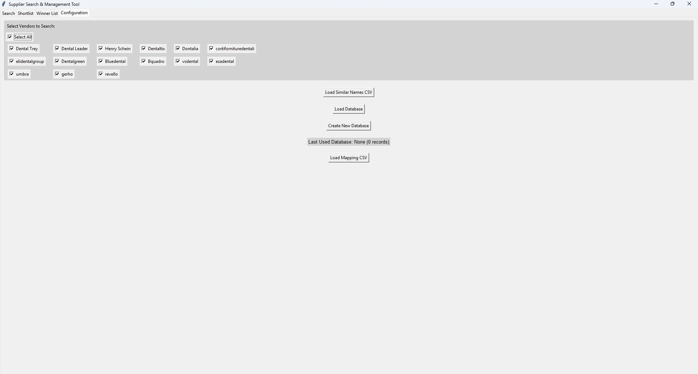 |  |

| Vendors in DB | Short List | Winner List |
|:-------------:|:----------:|:-----------:|
|  |  |  |

**Highlights:** Real-time + DB hybrid search · Vendor shortlisting · Winner selection workflow · Full config system

<br/>

---

## `fusselbaugh` — PDF Data Extraction Tool

**Automated PDF extraction tool with multi-stage processing — from initial parse to structured final output.**

| Initial | Intermediate | Extraction | Tool |
|:-------:|:------------:|:----------:|:----:|
| 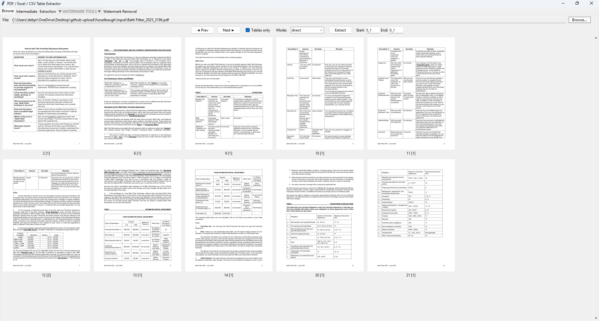 | 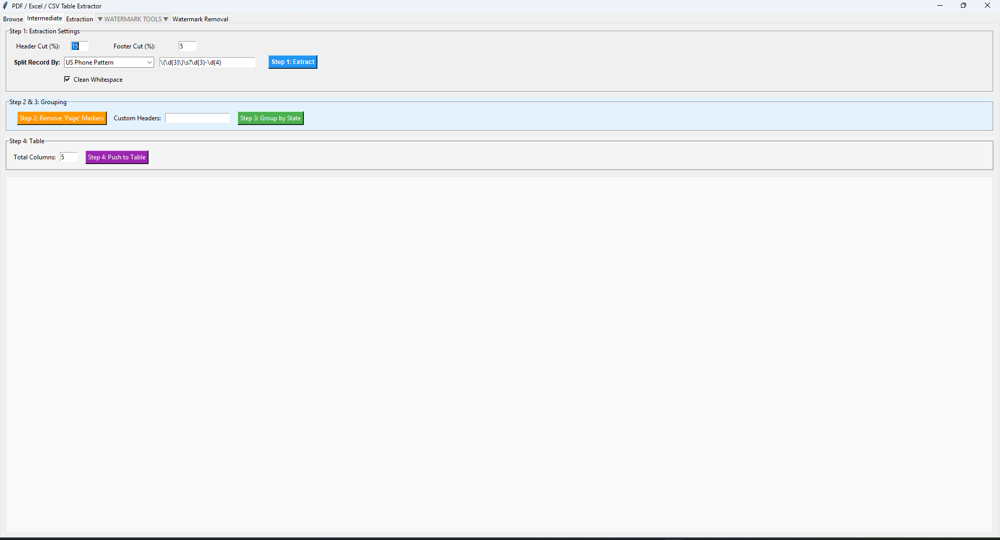 | 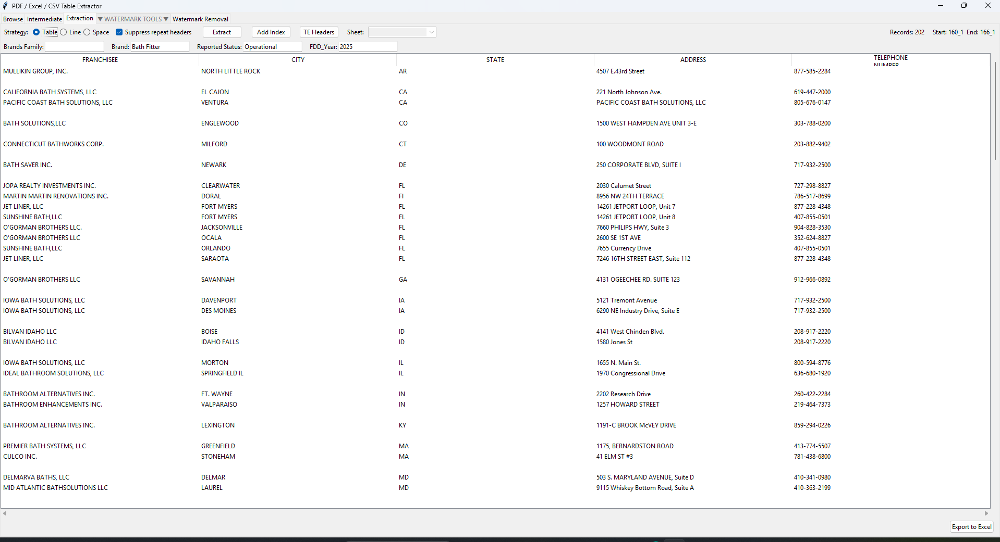 |  |

**Highlights:** PDF parsing · Staged extraction pipeline · Structured data output

<br/>

---

## `josh_music` — Music Analysis & Graph Visualization Tool

**An advanced music analysis platform with interactive graph visualization, parameter tuning, and result export.**

| Upload Page | Config |
|:-----------:|:------:|
|  |  |

| Graph Analysis | With Extra Parameters | With Changing Values | Results |
|:--------------:|:--------------------:|:--------------------:|:-------:|
|  |  |  | 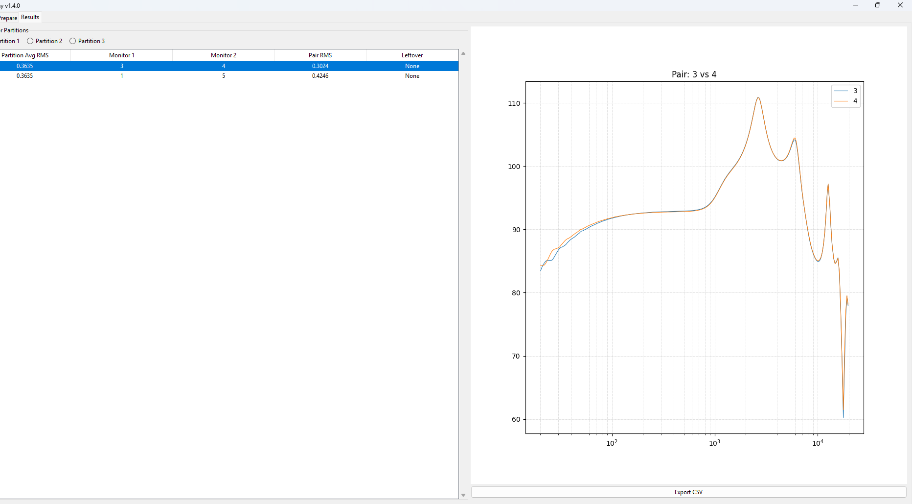 |

**Highlights:** Audio file batch processing · Interactive graph output · Dynamic parameter control · Result export

<br/>

---

## `labels` — Label Processing & Verification Tool

**Automated label checking tool that runs validation processes and flags issues across label batches.**

| Tool | Process Run | Checking |
|:----:|:-----------:|:--------:|
| 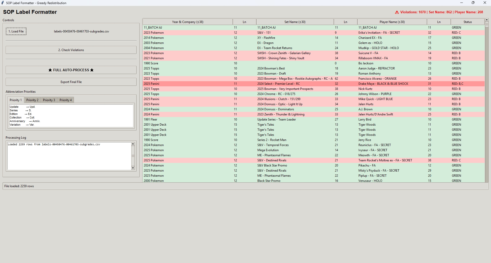 |  | 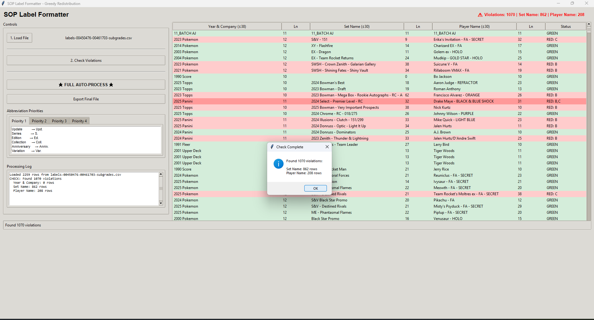 |

**Highlights:** Label validation · Batch processing · Pass/fail reporting · Visual verification

<br/>

---

## `marketmap` — Gemini-Powered Image Analysis Tool

**AI-powered market map tool using Google Gemini to analyze and extract structured data from images.**

| Initial Step | Before Gemini | Partial Analysis | After Gemini |
|:------------:|:-------------:|:----------------:|:------------:|
|  |  |  |  |

**Highlights:** Gemini Vision API integration · Image-to-data extraction · Step-by-step processing with progress visibility

<br/>

---

## `pascal` — Lumber Product Scraper & Analysis Tool

**Two-phase tool for scraping lumber product data and performing price/availability analysis with flagging.**

#### Initial Setup Phase

| Config | Master DB | New Results | Flagged Results | Analysis |
|:------:|:---------:|:-----------:|:---------------:|:--------:|
|  |  |  |  |  |

#### Working Phase

| Master DB | Search | Scrape Analysis |
|:---------:|:------:|:---------------:|
|  |  |  |

**Highlights:** Two-phase workflow · Price flag detection · Master DB management · On-demand single scrape mode

<br/>

---

## `paul_project` — PDF Extraction with Manual Crop

**PDF data extraction tool supporting both automatic parsing and manual region-select cropping for precise data capture.**

#### Initial Extraction Phase

| Automatic Extraction | Manual Crop |
|:--------------------:|:-----------:|
|  |  |

#### Working Process

| After Loading PDF | Click on Image | Cropping Process | Manual Crop Result |
|:-----------------:|:--------------:|:----------------:|:------------------:|
|  |  |  |  |

**Highlights:** Auto + manual extraction modes · Interactive crop UI · Precise region selection · Structured output

<br/>

---

## `pdf_manipulation` — PDF Editor & Manipulator

**A comprehensive PDF manipulation tool supporting group editing, summary management, and page-level operations.**

| Tool | Groups Edit | Summaries Edit | Summaries Save | Overview |
|:----:|:-----------:|:--------------:|:--------------:|:--------:|
| 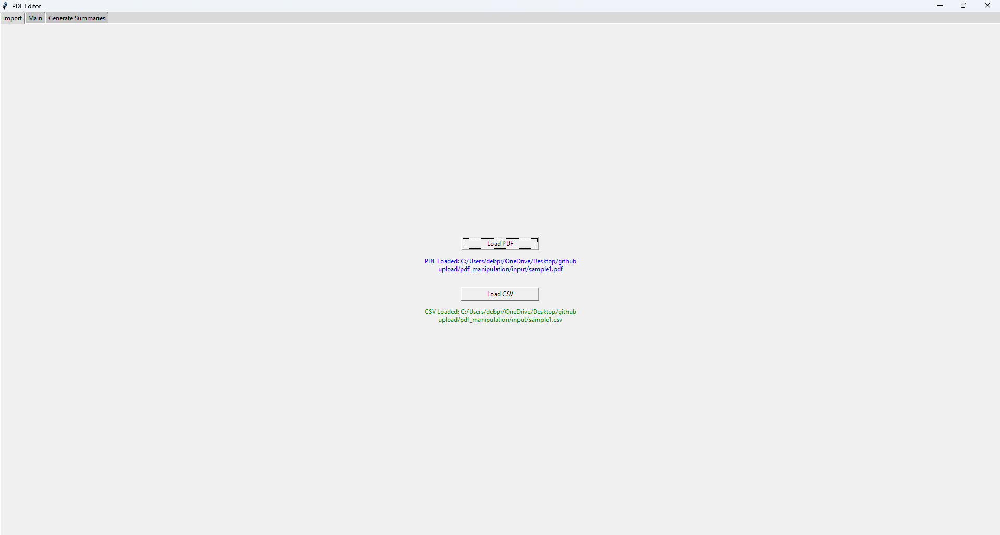 |  |  |  |  |

**Highlights:** Group-based page management · Summary editing · Save/export workflows · Clean UI

<br/>

---

## `pdf_watermark` — PDF Watermarking Tool

**Fast, reliable tool for applying custom watermarks to PDF files with configurable placement and styling.**

| Process Step 1 | Process Step 2 |
|:--------------:|:--------------:|
|  |  |

**Highlights:** Custom watermark placement · Batch PDF support · Preview before export

<br/>

---

<div align="center">

<br/>

```
Built with precision. Delivered with results.
```


<br/>


</div>